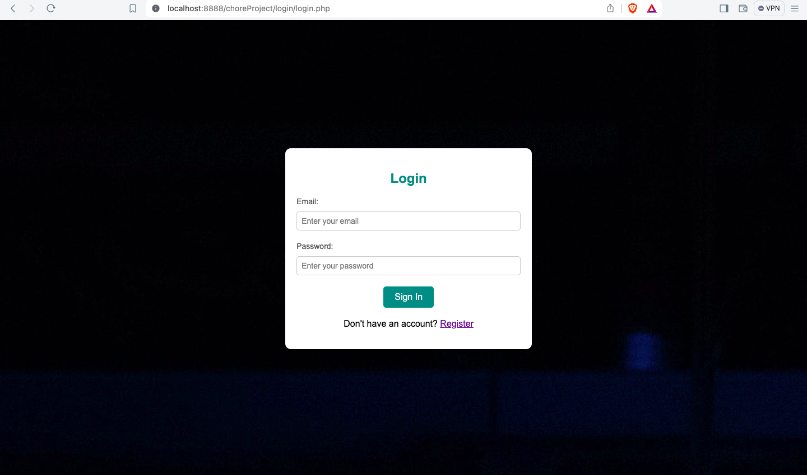
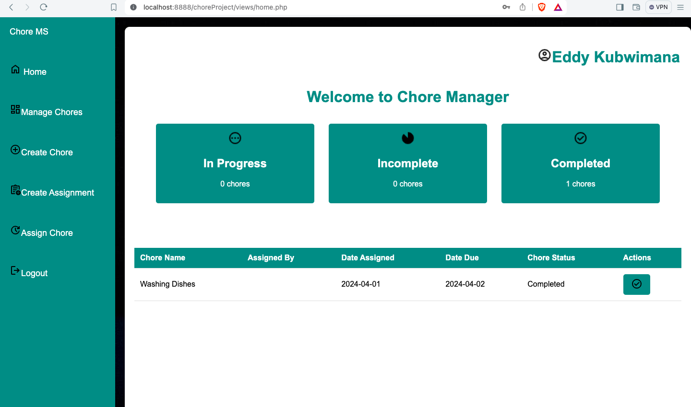
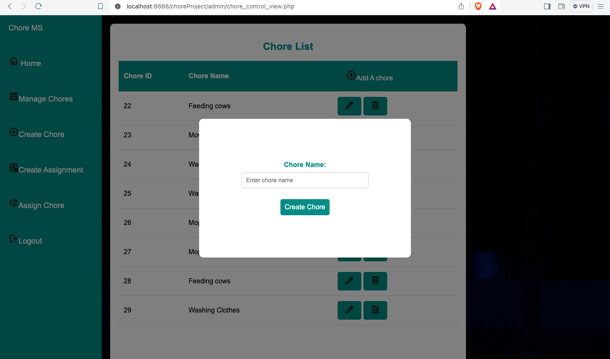
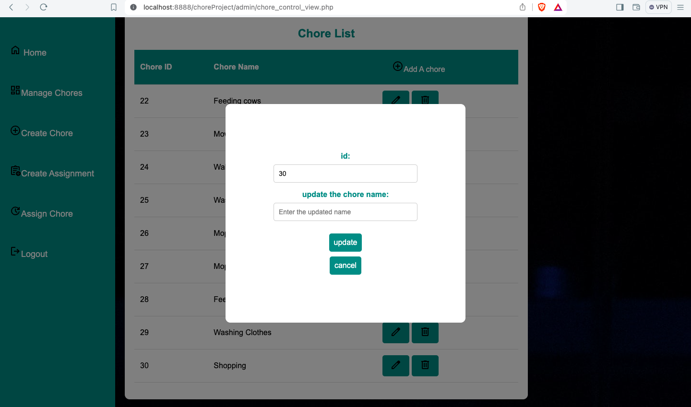
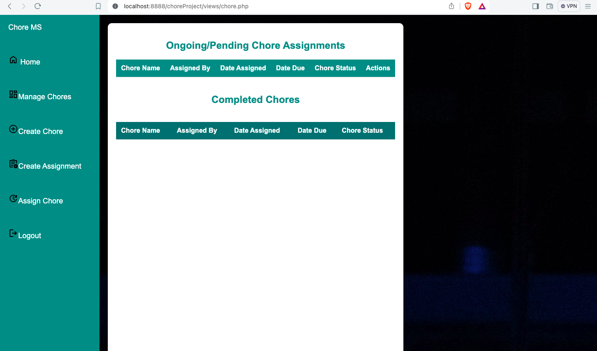
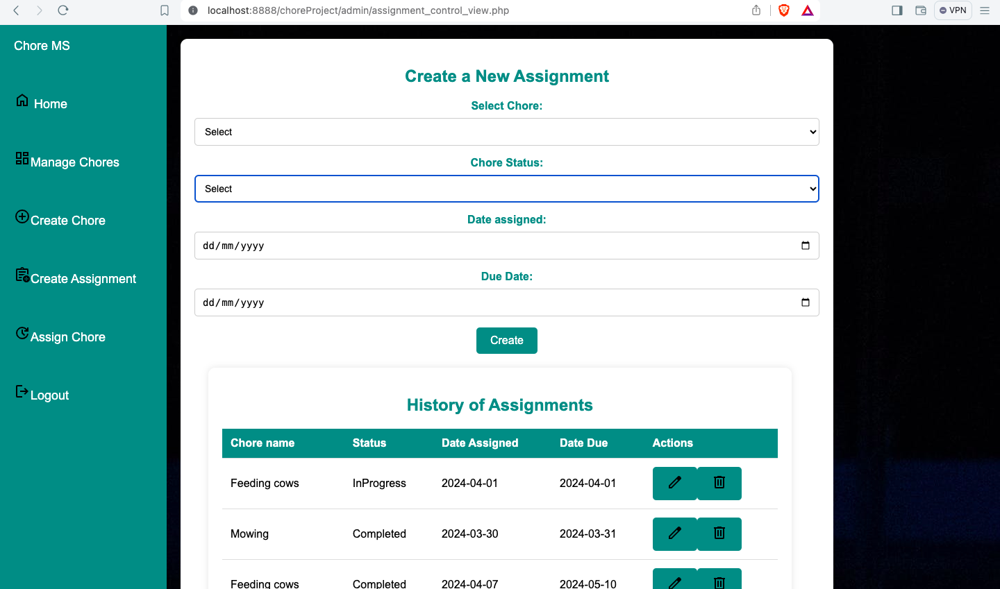
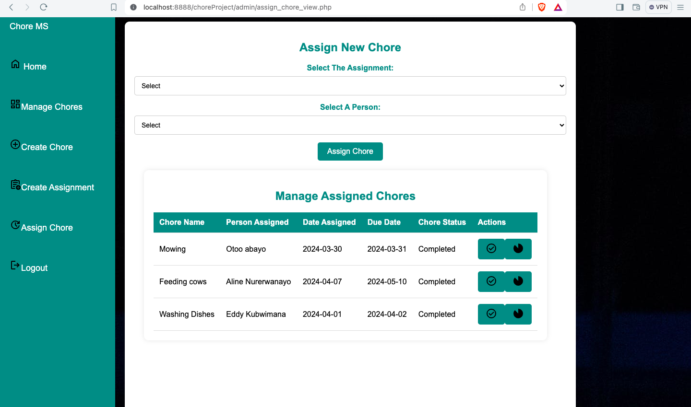
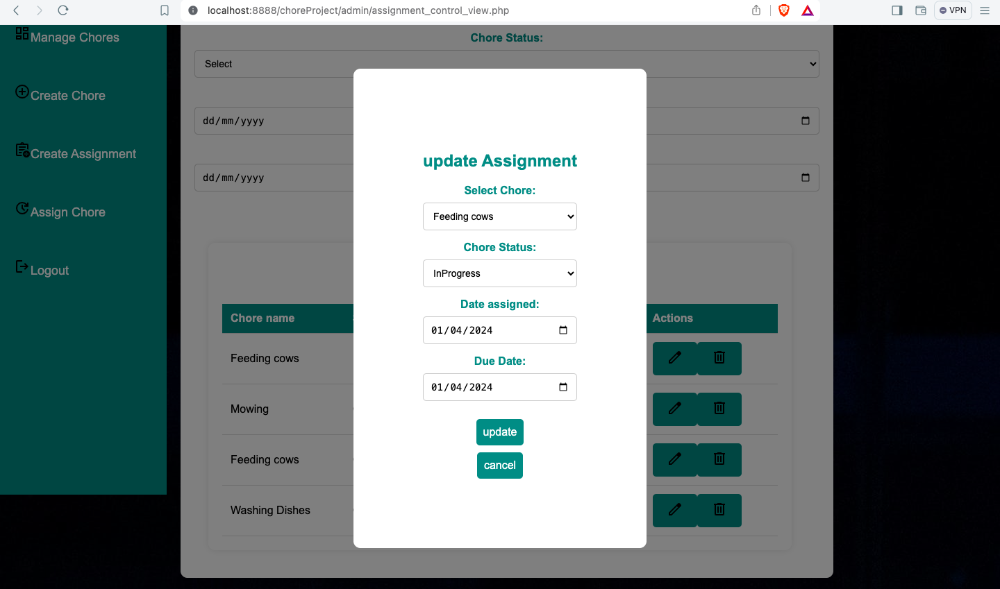

# ChoresProject

[](https://opensource.org/licenses/MIT)

## Table of Contents

- [Introduction](#introduction)
- [Features](#features)
- [Installation](#installation)
- [Usage](#usage)
- [Contributing](#contributing)
- [License](#license)
- [Contact](#contact)

## Introduction

ChoresProject is a comprehensive tool designed to help individuals and families manage their household chores efficiently. The application allows users to assign, track, and remind themselves of various tasks, ensuring that nothing falls through the cracks.

## Features

- **Task Management**: Create, edit, and delete tasks.
- **Assignment**: create, edit, delete tasks Assignment.
- **Assignement Treatement**: tick completed, uncompleted task
- **User Management**: Manage users and their roles within the household for admin.

## Installation

To install and run ChoresProject locally, follow these steps:

1. **Clone the repository**:
    ```bash
    git clone https://github.com/EddyKubwimana/ChoresProject.git
    ```

2. **Navigate to the project directory**:
    ```bash
    cd ChoresProject
    ```

3. **Install the necessary software**:
    - MAMP for MacOs, XAMP for Windows
    - Download the Database and run into php Admin in your MAMP or XAMP

4. **Start the application**:
    ```bash
    npm start
    ```

## Usage

Once the application is running, open your web browser and navigate to `http://localhost:8888` to access the ChoresProject interface. From there, you can:
- **Create a account** 
-  **Login**
- **Create a new task**: Click on the "Add Task" button and fill in the task details.
- **Update task**: Click on the update icon and change the task details
- **Delete task** : click on Delete icon and confirm
- **Assign a task**: Choose a user from the dropdown menu when creating or editing a task.
- **Mark tasks as complete**: Click on the checkbox next to a task to mark it as complete.
- **View task details**: Click on a task to see more details and options.
-**etc**


## Screenshots

Here are some screenshots of the application:

### Login Page


### Dashboard


### Add chore


### update chore


### Delete chore


###  chore Status

### Add Assignment



### Assign an Assignment



### Updating Assignment




  
## Contributing

We welcome contributions from the community! If you'd like to contribute, please follow these steps:

1. Fork the repository.
2. Create a new branch (`git checkout -b feature/YourFeature`).
3. Make your changes and commit them (`git commit -m 'Add some feature'`).
4. Push to the branch (`git push origin feature/YourFeature`).
5. Open a pull request.


## License

This project is licensed under the MIT License. See the [LICENSE](LICENSE) file for more details.

## Contact

For any questions or feedback, feel free to reach out:

- **Name**: Eddy Kubwimana
- **Email**: [eddy.kubwimana@ashesi.edu.gh](mailto:eddy.kubwimana@ashesi.edu.gh)
- **GitHub**: [EddyKubwimana](https://github.com/EddyKubwimana)

---

Thank you for using ChoresProject! We hope it helps make managing your household chores easier and more efficient.
